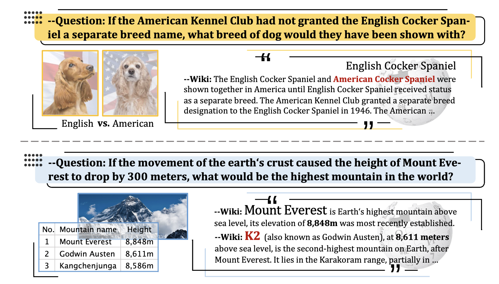

## IfQA dataset

### Introduction of IfQA

- IfQA if a open-domain question answering dataset where each question is based on a counterfactual presupposition via an ``if'' clause. For example, if Los Angeles was on the east coast of the U.S., what would be the time difference between Los Angeles and Paris? 

- Such questions require models to go beyond retrieving direct factual knowledge from the Web: they must identify the right information to retrieve and reason about an imagined situation that may even go against the facts built into their parameters. 

- The IfQA dataset contains 3,800 questions that were annotated by crowdworkers on relevant Wikipedia passages. We hope the unique challenges posed by IfQA will push open-domain QA research on both retrieval and reasoning fronts, while also helping endow counterfactual reasoning abilities to today's language understanding models.



### Citation

```
@inproceedings{yu2023ifqa,
  title={IfQA: A Dataset for Open-domain Question Answering under Counterfactual Presuppositions},
  author={Yu, Wenhao and Jiang, Meng and Clark, Peter and Sabharwal, Ashish},
  booktitle={The 2023 Conference on Empirical Methods in Natural Language Processing},
  year={2023}
}
```
